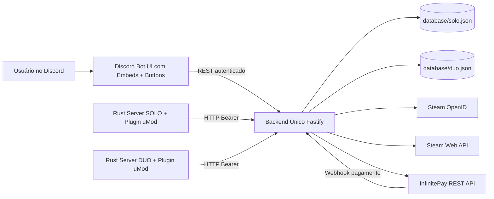

# Sistema Completo de Venda de VIP para Rust (Discord + Backend + InfinitePay + Steam + uMod)

## 1) Arquitetura geral do sistema



### Componentes
- **Discord Bot**: interface visual e fluxo de compra para o usuário.
- **Backend único**: orquestra autenticação Steam, checkout InfinitePay, webhook e status VIP.
- **Bancos JSON separados por servidor**: isolamento de dados SOLO/DUO.
- **Plugin uMod/Oxide**: sincronização automática de grupos `vip` e `vip+`.

---

## 2) Estrutura de pastas do backend

```txt
apps/
  backend/
    src/
      config.js
      server.js
      routes/
        authRoutes.js
        discordRoutes.js
        webhookRoutes.js
        pluginRoutes.js
      services/
        jsonDatabase.js
        steamService.js
        infinitePayService.js
        vipService.js
  discord-bot/
    src/
      bot.js
plugins/
  oxide/
    VipSync.cs
database/
  solo.json
  duo.json
```

---

## 3) Estrutura de dados JSON

Cada arquivo (`solo.json`, `duo.json`) usa:

```json
{
  "users": {
    "<discordId>": {
      "discordId": "123",
      "steamId64": "7656119...",
      "vipType": "vip",
      "startDate": "2026-01-10T00:00:00.000Z",
      "expirationDate": "2026-02-10T00:00:00.000Z",
      "paymentStatus": "paid",
      "purchaseHistory": [
        {
          "orderNsu": "vip-...",
          "vipType": "vip+",
          "priceCents": 4990,
          "paidAt": "2026-01-10T00:00:00.000Z",
          "transactionId": "tx_123"
        }
      ]
    }
  },
  "orders": {
    "<orderNsu>": {
      "orderNsu": "vip-...",
      "discordId": "123",
      "vipType": "vip+",
      "priceCents": 4990,
      "createdAt": "...",
      "paymentStatus": "pending|paid",
      "transactionId": "...",
      "paidAt": "..."
    }
  },
  "purchaseHistory": [
    {
      "discordId": "123",
      "steamId64": "7656119...",
      "orderNsu": "vip-...",
      "vipType": "vip",
      "priceCents": 2990,
      "paidAt": "...",
      "transactionId": "..."
    }
  ]
}
```

---

## 4) Fluxo completo do Discord Bot

1. Usuário executa `/vip`.
2. Bot mostra embed com botões:
   - `Servidor SOLO`
   - `Servidor DUO`
3. Usuário seleciona servidor.
4. Bot consulta backend (`/discord/link-status`).
5. Se Steam não vinculada, mostra botão link: `🔗 Vincular Steam`.
6. Usuário autentica no Steam OpenID.
7. Backend valida assertion OpenID e SteamID64 + Steam Web API.
8. Voltando ao Discord, o usuário vê botões:
   - `🟢 Comprar VIP`
   - `🔵 Comprar VIP+`
9. Bot chama `/discord/create-checkout`.
10. Backend cria pedido interno + checkout InfinitePay REST.
11. Bot envia link de pagamento.
12. Webhook InfinitePay confirma pagamento.
13. Backend marca pedido como pago e ativa/renova VIP.
14. Plugin Rust busca status e aplica grupo `vip` ou `vip+`.

---

## 5) Exemplos de embeds do bot

### Embed inicial
- **Título:** `🛒 Loja VIP Rust`
- **Descrição:** seleção de servidor e início do fluxo.

### Embed após seleção do servidor
- Exibe:
  - status Steam (`✅ Vinculada` ou `❌ Não vinculada`)
  - plano atual
  - botão de vincular ou botões de compra

### Embed após checkout
- **Título:** `💳 Checkout criado com sucesso`
- Exibe plano, `order_nsu` e link da InfinitePay.

---

## 6) Endpoints REST do backend

### Health
- `GET /health`

### Steam OpenID
- `GET /auth/steam/start?discordId=<id>&serverType=solo|duo`
- `GET /auth/steam/callback`

### Discord (autenticado com `x-discord-token`)
- `GET /discord/link-status?serverType=solo|duo&discordId=<id>`
- `POST /discord/create-checkout`

Body:
```json
{
  "serverType": "solo",
  "discordId": "123",
  "vipType": "vip|vip+"
}
```

### InfinitePay Webhook
- `POST /webhooks/infinitepay`

### Plugin Rust (Bearer token)
- `GET /plugin/vip-status?serverType=solo|duo&steamId64=<steamid64>`

Resposta:
```json
{
  "active": true,
  "vipType": "vip+",
  "expirationDate": "2026-02-10T00:00:00.000Z",
  "discordId": "123"
}
```

---

## 7) Integração completa com InfinitePay

Endpoint utilizado:
- `POST https://api.infinitepay.io/invoices/public/checkout/links`

Campos enviados pelo backend:
- `handle`: fixo do vendedor (`INFINITEPAY_SELLER_HANDLE`)
- `price`: valor em centavos
- `order_nsu`: identificador único
- `redirect_url`: pós-pagamento
- `webhook_url`: confirmação automática
- `metadata`: serverType, discordId, steamId64, vipType

Fluxo:
1. Backend cria `order_nsu` único.
2. Persiste pedido como `pending`.
3. Cria checkout via REST API da InfinitePay.
4. Recebe webhook assinado.
5. Valida assinatura HMAC (`x-infinitepay-signature`).
6. Marca pedido como `paid`.
7. Atualiza/renova VIP com expiração.

---

## 8) Integração completa com Steam OpenID

Provider:
- `https://steamcommunity.com/openid/login`

Processo:
1. Backend gera URL OpenID com `return_to`, `realm` e `state` (discord+servidor).
2. Steam autentica usuário.
3. Callback recebe `openid.claimed_id`.
4. Backend valida assertion OpenID (`check_authentication`).
5. Extrai `SteamID64` do `claimed_id`.
6. Valida SteamID com Steam Web API (`ISteamUser/GetPlayerSummaries`).
7. Persiste vínculo `DiscordID -> SteamID64` no JSON do servidor selecionado.

---

## 9) Código base do plugin Rust (uMod/Oxide)

Arquivo:
- `plugins/oxide/VipSync.cs`

Comportamento:
- `OnUserConnected` consulta backend e sincroniza VIP.
- Timer periódico revalida jogadores online.
- Remove grupos antigos antes de aplicar (`vip` / `vip+`).
- Nunca usa `vipplus`; apenas `vip+`.
- Endpoint usado: `/plugin/vip-status` com Bearer token.

---

## 10) Segurança e escalabilidade (produção)

### Segurança básica aplicada
- Token compartilhado para chamadas do Discord Bot.
- Bearer token para plugin Rust.
- Verificação de assinatura de webhook (HMAC).
- Validação de `serverType`, `vipType` e payloads mínimos.
- Isolamento dos bancos por servidor (SOLO/DUO).

### Recomendações para produção
- Migrar JSON para PostgreSQL/Redis com locks transacionais.
- Adicionar rate limiting por IP e por DiscordID.
- Adicionar idempotência robusta em webhook.
- Adicionar fila (BullMQ/RabbitMQ) para processamento de eventos.
- Observabilidade: logs estruturados, tracing e métricas.
- Secrets em cofre (Vault/SSM), nunca hardcoded.

---

## Variáveis de ambiente

### Backend
```bash
PORT=3000
HOST=0.0.0.0
BACKEND_PUBLIC_URL=http://localhost:3000
STEAM_API_KEY=...
STEAM_OPENID_REALM=http://localhost:3000
INFINITEPAY_API_KEY=...
INFINITEPAY_SELLER_HANDLE=seu-handle
INFINITEPAY_WEBHOOK_SECRET=...
PLUGIN_SHARED_TOKEN=...
DISCORD_SHARED_TOKEN=...
REDIRECT_AFTER_PAYMENT=https://discord.com/channels/@me
```

### Discord Bot
```bash
DISCORD_BOT_TOKEN=...
BACKEND_URL=http://localhost:3000
DISCORD_SHARED_TOKEN=...
```

## Execução

```bash
npm install
npm run check
npm --workspace @rust-vip/backend run start
npm --workspace @rust-vip/discord-bot run start
```
